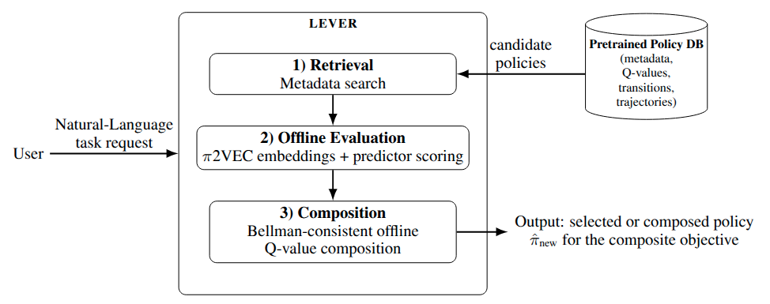

# LEVER

[]()

Inference-time policy composition for GridWorld reinforcement learning.



## Setup

The project uses `uv` for environment management.

```bash
make sync
```

That creates `.venv/` from [pyproject.toml](pyproject.toml) and [uv.lock](uv.lock). The repository pins Python 3.12 in [.python-version](.python-version).

For manual runs, use:

```bash
uv run python <script>.py ...
```

## Repository Layout

The experiment entrypoints are grouped by workflow:

- `tabular/`: tabular policy preparation and evaluation
- `dqn/`: DQN policy preparation and evaluation
- `ppo/`: PPO policy preparation and evaluation

## Tabular SARSA Libraries

The tabular workflow now exposes four explicit SARSA policy libraries:

- `states_8_0`
- `states_8_99`
- `states_16_0`
- `states_16_99`

They correspond to:

- 8x8 with `gamma=0`
- 8x8 with `gamma=0.99`
- 16x16 with `gamma=0`
- 16x16 with `gamma=0.99`

## Makefile Commands

List all commands:

```bash
make help
```

Train the four SARSA libraries:

```bash
make states-8-0
make states-8-99
make states-16-0
make states-16-99
```

Build pi2vec assets:

```bash
make prep-8-0
make prep-8-99
make prep-16-0
make prep-16-99
```

Run the composition experiments:

```bash
make exp-8-0
make exp-8-99
make exp-16-0
make exp-16-99
```

Generate comparison plots:

```bash
make plots-8-0
make plots-8-99
make plots-16-0
make plots-16-99
```

Run the hybrid `top-k` sweeps:

```bash
make sweep-8-0
make sweep-8-99
make sweep-16-0
make sweep-16-99
```

Run full pipelines:

```bash
make repro-8-0
make repro-8-99
make repro-16-0
make repro-16-99
make repro-all
```

## Reproducing the Experiments

For any one configuration:

1. Run `make sync`.
2. Train the library with the matching `make states-*` target.
3. Build pi2vec assets with the matching `make prep-*` target.
4. Run the experiment with the matching `make exp-*` target.
5. Generate plots with the matching `make plots-*` target.

The tabular entrypoints used by the Makefile are:

- `tabular/full_experiment.py`
- `tabular/pi2vec_preparation.py`
- `tabular/targeted_direct_eval.py`
- `tabular/hybrid_direct_eval.py`

The DQN and PPO workflows are also present under `dqn/` and `ppo/`.

## DQN And PPO Workflows

The deep-RL commands are available through the Makefile as well.

### DQN

Train the 8x8 DQN library with the settings documented in [dqn_train.md](dqn_train.md):

```bash
make dqn-train-8
```

Train the 16x16 DQN library:

```bash
make dqn-train-16
```

Build the DQN pi2vec assets:

```bash
make dqn-prep-8
```

```bash
make dqn-prep-16
```

Run the DQN composition experiment:

```bash
make dqn-exp-8
```

```bash
make dqn-exp-16
```

Run the full DQN workflow:

```bash
make dqn-repro-8
make dqn-repro-16
```

These commands use:

- training script: `policy_reusability/data_generation/deeprl/train_dqn.py`
- preparation script: `dqn/pi2vec_preparation.py`
- experiment script: `dqn/full_experiment.py`

### PPO

Train the 8x8 PPO library with the settings documented in [ppo_train.md](ppo_train.md):

```bash
make ppo-train-8
```

Build the PPO pi2vec assets:

```bash
make ppo-prep-8
```

Run the PPO composition experiment:

```bash
make ppo-exp-8
```

Run the full PPO workflow:

```bash
make ppo-repro-8
```

These commands use:

- training script: `policy_reusability/data_generation/deeprl/train_ppo.py`
- preparation script: `ppo/pi2vec_preparation.py`
- experiment script: `ppo/full_experiment.py`

## Troubleshooting

- If dependency metadata changes, run `make lock` and then `make sync`.
- If artifacts are missing for one configuration, rerun the matching `prep-*` or `exp-*` target.
